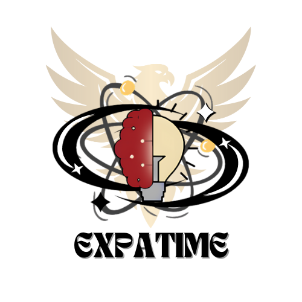

# Competition & Seminar Management Website

  

## Description

This is a web-based application designed to manage **seminars and competitions** with ease, built for events **Expasign x Edutime** Event.  

Users can register for events, upload payment proof, and submit project.
Meanwhile, admins have full control over data management, participant monitoring, and payment confirmations using a dedicated dashboard.

## Screenshot

<table>
  <tr>
    <td></td>
    <td></td>
    <td></td>

  </tr>
  <tr>
    <td></td>
    <td></td>
  </tr>
</table>

## Features

- ✅ Register for competitions and seminars
- ✅ Competition project submission
- ✅ Automatic payment confirmation via Saweria Webhook
- ✅ Manual payment confirmation via admin dashboard
- ✅ Admin dashboard to monitor all registrations

## Architecture

- Laravel
- React
- FrankenPHP
- Tailwind CSS
- MySQL

## Website :

https://expasign-edutime.site/